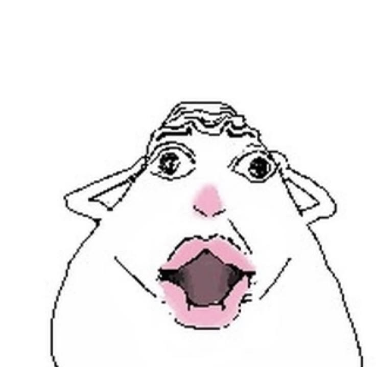

# Hamster Reacts

<table>
  <tr>
    <td></td>
    <td></td>
  </tr>
</table>

Pull a face at your webcam. It works out *which* face, and drops the matching
hamster over your head, scaled to follow you around the frame. You can extend and
add more hamsters to your heart's desire.

Point Zoom at its virtual camera and the whole call sees it.

```bash
python main.py                 # preview + virtual camera
python main.py --background    # no window; keep the camera alive for Zoom / FaceTime / Meet
python main.py --no-vcam       # preview only
python main.py --cam 0         # skip auto-discovery, force a camera index
python main.py --size 1280x720 # force a meeting-friendly output size
```

Twelve reactions: shocked, hearts, shh, thumbs up, tongue out, angry, crying,
queen, smirk, sad, big mouth, and happy.

First run asks you to sit still for five seconds so the expression thresholds
are calibrated to *your* face instead of to a number someone guessed.

---

## Setup

```bash
python3.12 -m venv venv
source venv/bin/activate           # Windows: venv\Scripts\activate
pip install -r requirements.txt
python main.py                     # must be this python, not system python3
```

Python 3.11 or 3.12. `python3` on a recent Mac is often 3.14 — that installs
MediaPipe 1.x, which aborts with `Service is unavailable`. Always run inside
the venv.

Then download the two MediaPipe models into `models/` (~10 MB) if they aren't
there already — first run does this itself:

```bash
mkdir -p models
curl -L -o models/face_landmarker.task \
  https://storage.googleapis.com/mediapipe-models/face_landmarker/face_landmarker/float16/1/face_landmarker.task
curl -L -o models/hand_landmarker.task \
  https://storage.googleapis.com/mediapipe-models/hand_landmarker/hand_landmarker/float16/1/hand_landmarker.task
```

**Don't unpin the dependencies.** MediaPipe 0.10.30+ (including 1.0.x) ships
macOS wheels that abort the moment they open a detector, so it's held at
0.10.21. That build needs NumPy 1.x, and OpenCV 5 needs NumPy 2 — and 0.10.21
asks for an *unpinned* `opencv-contrib-python`, which quietly drags OpenCV 5 and
therefore NumPy 2 back in. That's why the OpenCV pins are in there even though
nothing in the code cares. Unpin one and you have to unpin all three.

---

## Running it

```bash
python main.py                 # preview + virtual camera
python main.py --background    # no window; Ctrl+C to stop
```

On first launch (or any time `calibration.json` is missing) it records five
seconds of a bored face, then starts the overlay loop. Recalibrate later with
`c` if the lighting changed or it started firing on nothing.

| key | does |
|---|---|
| `q` | quit (preview window) |
| `c` | recalibrate (five seconds, same as first run) |
| Ctrl+C | quit (`--background`, or the terminal in either mode) |

It prints the cameras it found and which one it picked. On macOS the OpenCV
index is *not* "0 = built-in": Continuity Camera and OBS Virtual Camera often
sit in front of FaceTime. Auto-discovery prefers a physical camera (external
UVC first, then FaceTime) and only falls back to Continuity or OBS if nothing
else produces frames. Pass `--cam N` if it guessed wrong.

---

## How it actually runs

You do **not** want this to start when another app opens the camera. That
doesn't work, and building a background watcher for "camera in use" would not
fix it.

macOS (and Windows, and Linux) give a camera to **one** process at a time. If
Zoom already grabbed FaceTime HD, this script cannot also read it to paint
hamsters on top. The meeting app has to see a *different* device — a virtual
camera that *this* process publishes:

```
physical webcam  →  Hamster Reacts  →  "OBS Virtual Camera"  →  Zoom / FaceTime / Meet
```

So Hamster Reacts has to be running *first*, holding the real camera, and the
call app has to pick the virtual one. Leave it running for the whole call
(preview window, or `--background` with no window).

A later "real app" would be a menu-bar extra that starts at login and keeps
that virtual camera alive — not something that wakes up when FaceTime's LED
turns on. Detecting camera use is the wrong trigger: by then the call app
already owns the hardware.

---

## Using it in meetings

The virtual camera is on by default. Zoom, FaceTime, Google Meet, Teams,
Discord and OBS all treat it as a normal webcam once you select it.

**1. Install a backend** (once):

| OS | do this |
|---|---|
| macOS | install [OBS Studio](https://obsproject.com), open it once, quit it. Allow the camera extension in System Settings → Privacy & Security if macOS asks. |
| Windows | install OBS Studio, or run its virtual-camera installer |
| Linux | `sudo apt install v4l2loopback-dkms` then `sudo modprobe v4l2loopback` |

**2. Run it** before you join the call:

```bash
python main.py                 # first time: calibrate + preview, check it looks right
python main.py --background    # after that: no window, Ctrl+C to stop
```

It prints the device it's publishing to:

```
Virtual camera live: OBS Virtual Camera
```

Output is capped at 1080p (even dimensions) so FaceTime and Meet don't choke
on a 4K webcam. Pass `--size 1280x720` if an app is still fussy.

If the backend isn't installed, preview mode warns and continues without a
virtual camera. `--background` exits instead — there's nothing to publish.

**3. Pick that device** in the call app. Set it once; it usually sticks.

| app | where |
|---|---|
| Zoom | Settings → Video → Camera |
| Google Meet | More (⋮) → Settings → Video → Camera |
| FaceTime | Video menu (or the camera button in the call) → OBS Virtual Camera |
| Teams | Settings → Devices → Camera |
| Discord | Settings → Voice & Video → Camera |
| Chrome / Safari | lock icon in the URL bar → Camera, then the same in Meet's own settings |

**Start this before the call app.** Most of them scan for cameras once at
launch and won't notice a device that appeared later. FaceTime in particular
should be fully quit and reopened after the virtual camera first appears.

Leave Hamster Reacts running for the whole call. Quitting it makes the virtual
camera go idle (OBS's blue placeholder) and everyone sees that instead of you.

A few things worth knowing before you turn it on in front of colleagues. It
fires on its own. Everyone sees whatever it decides, so try it on a call with
someone who likes you first.

---

## The reactions

Checked top to bottom. The first match wins, so compound gestures sit above
generic expressions — otherwise a shocked open mouth would always lose to
`bigmouth`, and a smirk would lose to `happy`.

| pose | do this |
|---|---|
| `shocked` | both hands to the sides of your head, mouth open |
| `hearts` | two hands, index tips together, thumb tips together |
| `shh` | one index fingertip on your lips |
| `thumbsup` | one thumb up, clearly above the wrist and index |
| `dirpy` | tongue out |
| `angry` | brows down, mouth open |
| `crying` | squeeze your eyes shut and frown, or raise the inner brows |
| `queen` | kissy face / mouth pucker |
| `smirk` | turn your head and smile (or smile on one side) |
| `sad` | eyes open, frown or inner brows up |
| `bigmouth` | jaw drops, no hands involved |
| `happy` | broad smile |

Assets live in `assets/`, named after the pose — `hearts.jpg`, `shocked.jpg`.
Swap in your own by dropping a file with the right name; JPEG and PNG both
work, and PNG alpha channels composite properly. A missing asset gets you a
red placeholder, not a crash.

---

## Making it yours

### Swapping a hamster (~30 seconds)

Drop a file in `assets/` named after the pose — `hearts.png` replaces the
heart reaction. JPEG and PNG both work; PNG transparency composites properly,
JPEG just pastes. Press `c` if you want a clean calibration, then do the pose
and check it sits right on your head.

### Adding a pose

**1.** Drop `assets/thinking.png` in place.

**2.** Add it to `POSE_CONFIG` in `src/decide.py`. The numbers are
`(frames to fire, frames to linger)`:

```python
            "thinking":   (4, 14),
```

**3.** Add a branch to `_evaluate_raw_poses()`, *above* anything it might be
mistaken for. The method is checked top to bottom and the first match wins:

```python
        for h in hands:
            if face.near(h.palm_center, face.chin, 0.5) and not h.is_open:
                return "thinking"
```

You have `face` (`.nose` `.chin` `.mouth` `.top` `.center` `.width` `.height`),
`hands` (`.wrist` `.thumb_tip` `.index_tip` `.palm_center` `.is_open`),
`z_scores` for expressions in sigma, and `face.near(a, b, k)` for "within k
face widths" — which is what keeps it working at any distance from the camera.

**4.** Tune the arm/hold pair against the preview. Getting it to fire is easy;
the work is *stopping* doing it, doing everything nearby that might be confused
with it, and watching it stay quiet.

If your pose needs an expression channel that isn't used yet, read it out of
`z_scores` (`jawOpen`, `mouthSmileLeft`, `browDownRight`, … — all 52
blendshapes are already measured). You can't tune a number you can't see, so
print it on the preview frame while you're guessing.

### Two gotchas

`POSE_CONFIG` is not the check order. `_evaluate_raw_poses()` is. Adding the
name to the dict lets it arm and linger; putting the `return` in the wrong
place is what decides whether it ever wins.

If a new pose never fires, check the order of those returns before you touch
any threshold. Something earlier matching first is the usual cause, and
lowering a z-cutoff can't fix it.

---

## How it works

```
camera frame
     |
 1.  letterbox    pad to square (MediaPipe's face projector assumes one)
     |
 2.  MediaPipe    face: 478 landmarks + 52 blendshapes
                  hands: 2 x 21 points
     |
 3.  remap        landmarks projected back onto the original frame
     |
 4.  Baseline     expressions re-expressed in sigma above YOUR neutral face
     |
 5.  decide()     one ordered pass -- first pose that matches wins
     |
 6.  arm / hold   must persist N frames to fire, lingers ~14 frames after
     |
  overlay         scaled to your face, alpha-composited over the forehead
```

The face landmarker runs on the CPU delegate on purpose. The GPU/Metal path
on macOS aborts the moment it opens a detector; CPU is slower and works.

### Normalising away the camera

Landmarks come out as pixel coordinates, which depend on how far you're sitting
from the lens. So nothing is compared in pixels: every distance is divided by
the width of your face box first. `face.near(hand.index_tip, face.mouth, 0.28)`
means "within 28% of a face width", and that means the same thing at 40 cm and
at a metre and a half.

Head turn is the nose's offset from the face centre, divided by face width:
roughly 0 facing the camera, about 0.15 once you've looked aside far enough
for `smirk`. Already a ratio, so already scale-free.

The overlay is 1.2 face-widths across and sits 0.7 face-heights above the
forehead, so it tracks you as you lean in and out.

### Why fixed thresholds don't work, and what to do instead

This is the interesting part.

MediaPipe's blendshape values are **not zero when your face is at rest**, and
the offset is very personal. Some faces idle at `jawOpen` 0.02; others sit at
0.19 doing nothing. If your mouth naturally turns up you can read `mouthSmile`
0.3 while thinking about absolutely nothing.

So `jawOpen > 0.5` is not one threshold — it's a different threshold for every
face that meets it. Too eager for some, physically unreachable for others. Any
constant you pick is a compromise between people, and no individual user is the
average of those people.

Hamster Reacts measures your own neutral first. Five seconds of a bored face
records the **mean and the standard deviation** of all 52 channels, and from
then on every expression is scored as:

```
z = (what the channel reads now - your resting mean) / (your resting wobble + ε)
```

"6 sigma above your neutral jaw" means the same thing on every face. "Above 0.5"
doesn't. Same two gestures, on a face that idles low and sits still versus one
that idles high and fidgets:

```
                        still face        loose face
resting                 z  +0.1           z  +0.1        both quiet
gasp                    z +38.7           z  +8.7        both fire
nose scrunch            z +19.3           z  +5.5        both fire
```

That file is `calibration.json`. It's gitignored. Delete it, or press `c`, to
take another one.

---

## What's where

```
main.py                  camera, MediaPipe, overlay loop — the one to run
src/decide.py            ordered pose checks + arm/hold
src/calibration.py       five-second sit-still → z-scores
src/renderer.py          scale-to-face overlay
src/detection/parser.py  478 face points + 21 hand points → FaceData / HandData
src/detection/geometry.py  face.near() and the dataclasses
calibration.json         your neutral face (made on first run, gitignored)
requirements.txt         pinned on purpose — read the comments before changing them
assets/                  the hamsters, named after their pose
models/                  MediaPipe .task files (download once, gitignored)
```

Inside `src/decide.py`: `POSE_CONFIG` is the arm/hold block, and
`_evaluate_raw_poses()` is the ordered pose checks. `FaceBaseline` in
`src/calibration.py` is the five-second sit-still.

Want to change **what sets off what**? `_evaluate_raw_poses()`.
Want to change **how easily it goes off**? the z-cutoffs in that method, and
`POSE_CONFIG`.
